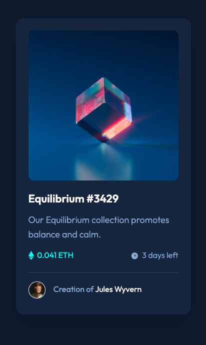
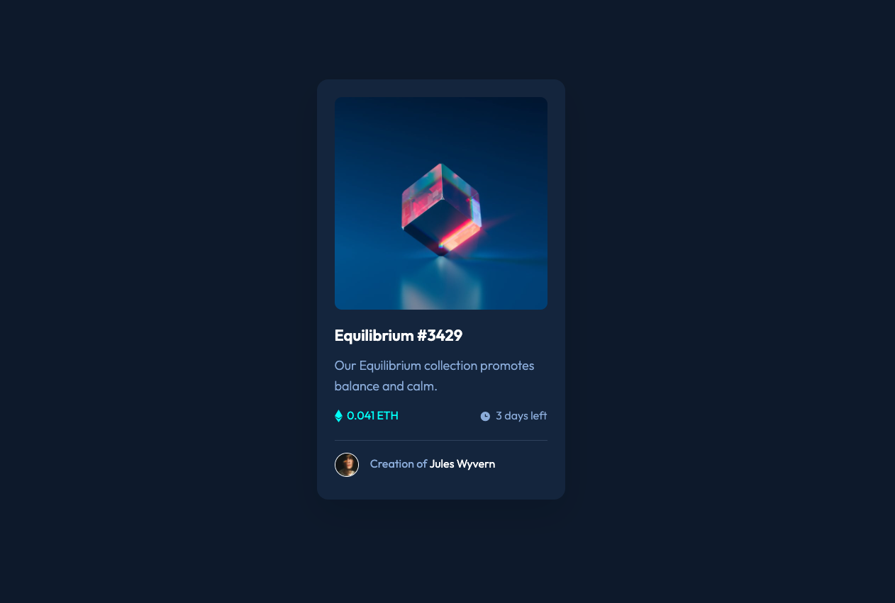

# Frontend Mentor - NFT preview card component solution

This is a solution to the [NFT preview card component challenge on Frontend Mentor](https://www.frontendmentor.io/challenges/nft-preview-card-component-SbdUL_w0U). Frontend Mentor challenges help you improve your coding skills by building realistic projects.

## Table of contents

- [Overview](#overview)
  - [The challenge](#the-challenge)
  - [Screenshot](#screenshot)
  - [Links](#links)
- [My process](#my-process)
  - [Built with](#built-with)
  - [What I learned](#what-i-learned)
  - [Continued development](#continued-development)
  - [Useful resources](#useful-resources)
- [Author](#author)

## Overview

### The challenge

Users should be able to:

- View the optimal layout depending on their device's screen size
- See hover states for interactive elements

### Screenshots

Mobile Design

Desktop Design

### Links

- Solution URL: [https://github.com/kennbach/nft-preview-card-component](https://github.com/kennbach/nft-preview-card-component)
- Live Site URL: [https://kennbach.github.io/nft-preview-card-component/](https://kennbach.github.io/nft-preview-card-component/)

## My process

### Built with

- Semantic HTML5 markup
- CSS Variables
- CSS Grid
- Mobile-first workflow
- Accessibility Aware

### What I learned

The biggest challenge for me on this project was implementing the product hover overlay image. I took a lot of twists and turns before I came across a viable solution on w3schools.com. I will link to that article (How To Image Hover Overlay) below.

### Continued development

My CSS positioning skills were definitely a weakness while handling the image hover overlay. I will be looking to strengthen my knowledge here as I move forward.

### Useful resources

- [w3schools: How to image hover overlay](https://www.w3schools.com/howto/howto_css_image_overlay.asp) - This was where I finally found the CSS only solution for handling the image hover overlay.

- [The Net Ninja: HTML & CSS Crash Course](https://youtube.com/playlist?list=PL4cUxeGkcC9ivBf_eKCPIAYXWzLlPAm6G) - This is a great resource to learn or refresh your HTML and CSS knowledge from the ground up.

- [The Net Ninja: CSS Variables](https://youtube.com/playlist?list=PL4cUxeGkcC9ii5PB2UMyYH7QFZWfGnVgZ) - This is a great resource to learn CSS variables.

- [The Net Ninja: CSS Grid](https://youtube.com/playlist?list=PL4cUxeGkcC9itC4TxYMzFCfveyutyPOCY) - This is a great resource to learn CSS grid.

- [Kevin Powell: Are you using the right CSS units?](https://youtu.be/N5wpD9Ov_To) - There are a lot of different units that we can use when writing CSS, in this video Kevin gives some general rules of thumb of which ones are best suited for which situations. This is also where I learned how to convert the root font-size to base-10.

- Both, [Kevin Powell](https://www.youtube.com/kepowob) and [The Net Ninja](https://www.youtube.com/c/TheNetNinja) have a virtual-ton of great web app development tutorials. I only listed a few above, but there are many, many more.

## Author

- Github - [kennbach](https://github.com/kennbach)
- Frontend Mentor - [@kennbach](https://www.frontendmentor.io/profile/kennbach)
